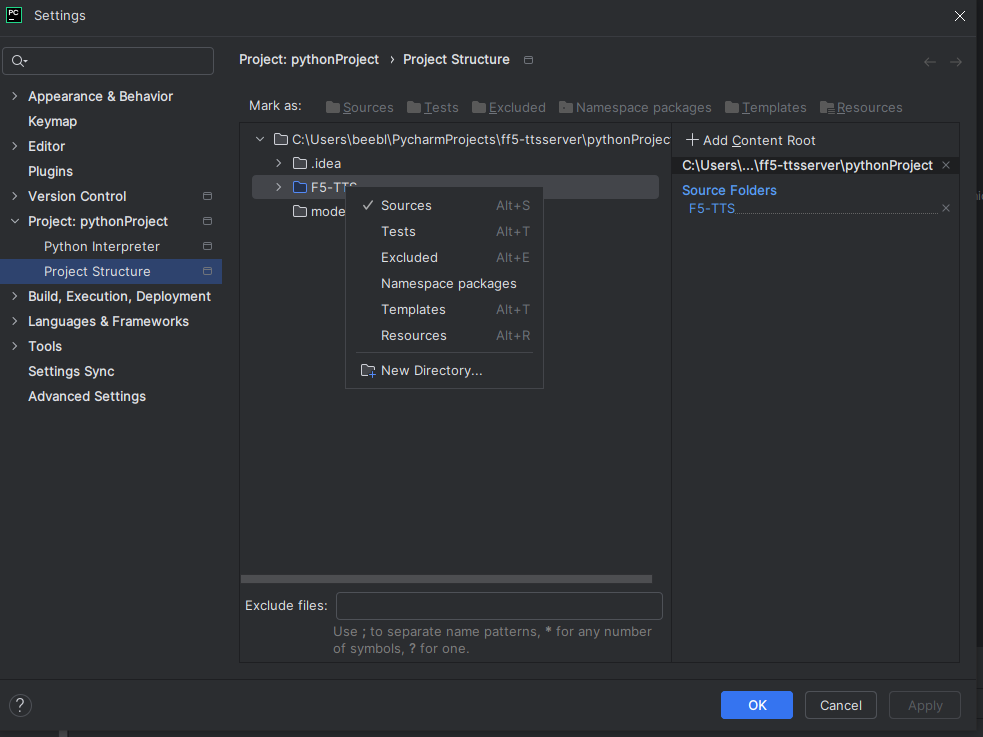

# ff5-ttssgrpc
This is a simple grpc tts server that can run inference for a single voice and prompt at a time.

## User Installation
### Download and init repository
```shell
git clone https://github.com/beeblebrox/ff5-ttsgrpc
git submodule update --recursive
```

### Setup python 3.10 conda environment, or your favorite env manager

## Install requirements
```shell
pip install -r requirements.txt
```

## Dev Information
### Generate grpc
From the base directory after venv is setup and sourced:

```bash
python generateproto.py
```

### IDE info
Make sure you add the directory <projectroot>/F5-TTS to your system path or marked as source in project.
#### PyCharm

